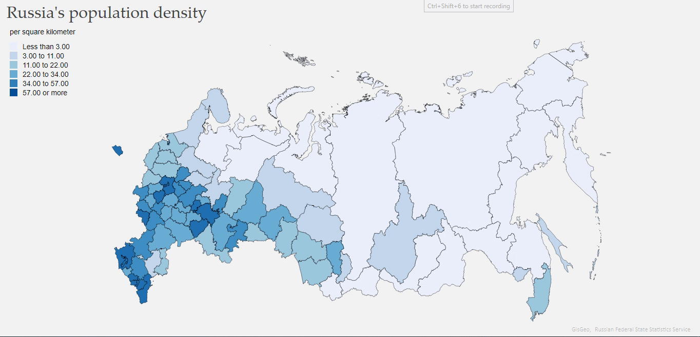
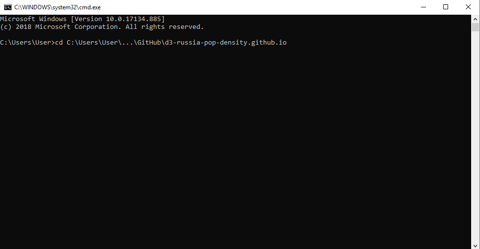

# d3-russia-pop-density.github.io
The Choropleth Map, designed using D3, conveys a general picture of population density across Russia in 2018. According to the result, distribution from the most populated areas to the least populated goes from European to the Asian part of the country. As this project is created in terms of Assignment 3 of Multimedia Cartography course, it is presented additionally as an interactive map that can help the user explore population density in more details and track the slightest changes across administrative divisions.

*How to set up this project locally:

#### 1. Run local server

a) Open cmd terminal and set working directory with cd command
  

b) Check the: ipconfig

  the server is run on this IPv4 Address - 000.000.0.000

c) Type and enter: python -m http.server 8000

d) Open http://localhost:8000 on a browser
  
  Congratulations, you run a server and can try the map!
  
  
  
#### 2. Links to the data contributors:

a) GISGeo data http://gisgeo.org - boundaries

b) Russian Federal State Statistics Service http://www.gks.ru - population
    

#### 3. Some sources on how to begin working with D3.js that I used:

a) How to set up D3 environment (free videos):

*O’Reilly training course
https://player.oreilly.com/videos/9781783283736

*Packt Video Youtube channel
https://www.youtube.com/watch?v=kR8l2fstPxw&list=PLTgRMOcmRb3NavVz_8M4rNjvLuuLE4kfs

b) D3 Workshop series by DUSPVIZ
http://duspviz.mit.edu/d3-workshop/mapping-data-with-d3/
